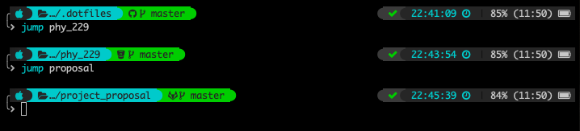
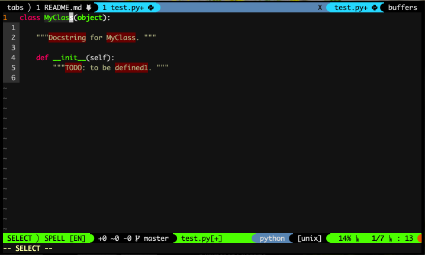

# Configuration files
### zsh


### vim


## tmux


This repo contains the config file that I usually use.

* zshrc
	* [zshmarks](https://github.com/jocelynmallon/zshmarks)
	* [k](https://github.com/supercrabtree/k)
	* [zsh-bd](https://github.com/Tarrasch/zsh-bd)
	* [calc.plugin.zsh](https://github.com/arzzen/calc.plugin.zsh)
	* [dircolors-solarized](https://github.com/seebi/dircolors-solarized)
	* [powerlevel9k](https://github.com/bhilburn/powerlevel9k)
	* [plugins from zsh](https://github.com/robbyrussell/oh-my-zsh)
* zsh history fix
* vimrc
	* [command-t](https://github.com/wincent/command-t)
	* [NERDtree](https://github.com/scrooloose/nerdtree)
	* [NERDtree syntax highlight](https://github.com/tiagofumo/vim-nerdtree-syntax-highlight)
	* [vim-devicons](https://github.com/ryanoasis/vim-devicons)
	* [vim-airline](https://github.com/vim-airline/vim-airline)
	* [vim-airline-theme](https://github.com/search?q=vim-airline-theme)
	* [ultisnips](https://github.com/SirVer/ultisnips)
	* [vim-snippets](https://github.com/honza/vim-snippets)
	* [vim-latex-live-preview](https://github.com/xuhdev/vim-latex-live-preview)
	* [vim-latex-suite](https://github.com/gerw/vim-latex-suite)
	* [youcompleteme](https://github.com/Valloric/YouCompleteMe) cmake required
	* [vim-fugitive](https://github.com/tpope/vim-fugitive)
	* [vim-gitgutter](https://github.com/airblade/vim-gitgutter)
	* [auto-pairs](https://github.com/jiangmiao/auto-pairs)
	* [ctrlp](https://github.com/ctrlpvim/ctrlp.vim)
	* [vim-commentary](https://github.com/tpope/vim-commentary)
	* [vim-easymotion](https://github.com/easymotion/vim-easymotion)
	* [vim-autoformat](https://github.com/Chiel92/vim-autoformat)
	* [vim-titlecase](https://github.com/christoomey/vim-titlecase)
	* [vim-tmux](https://github.com/tmux-plugins/vim-tmux)
* awesome wm
* termit terminal
* tmux

## Check.sh
This script is used to check the powerline font in terminal.
`$ ./check.sh`

## Setup for zshrc, tmux.conf and vimrc
### via curl
```
sh -c "$(curl -fsSL https://raw.githubusercontent.com/mjonyh/config/master/symdotfiles.sh)"
```
### via wget
```
sh -c "$(wget https://raw.githubusercontent.com/mjonyh/config/master/symdotfiles.sh -0 -)"
```

## Script for the New Mac setup

### via curl
```
sh -c "$(curl -fsSL
https://raw.githubusercontent.com/mjonyh/config/master/new_mac_setup.sh)"
```
### via wget
```
sh -c "$(wget https://raw.githubusercontent.com/mjonyh/config/master/new_mac_setup.sh -0 -)"
```

## Fonts
[Nerd-Fonts](https://nerdfonts.com) Required. 
