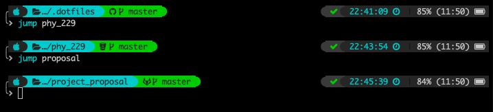
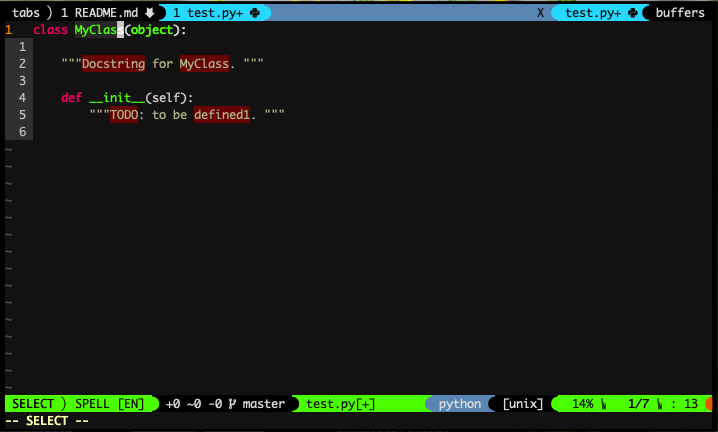

# Unified Development Environment

A professional, cross-platform configuration suite for **macOS** and **Linux** (Arch, Debian). This repository provides a unified setup for Zsh, Neovim, Tmux, and other development tools, designed for performance, aesthetics, and productivity.

## 📸 Screenshots

| Shell (ZSH + Starship)      | Neovim (Lua Config)         | Tmux Sessions                 |
| --------------------------- | --------------------------- | ----------------------------- |
|  |  |  |

---

## 🚀 Quick Start

One script to rule them all. Detects your OS and installs the appropriate packages and configurations.

```bash
git clone https://github.com/mjonyh/config.git ~/.dotfiles
cd ~/.dotfiles
./install.sh
```

### Installation Options

```bash
./install.sh --install-packages   # Only install system packages (Homebrew/Pacman)
./install.sh --setup-system       # Only configure system settings (Shell, Git, Defaults)
./install.sh --symlink-only       # Only link dotfiles (Safely backs up existing config)
./install.sh --all                # Run full installation (Default)
```

---

## 🛠️ Key Features

- **Cross-Platform**: Works on **macOS** (Homebrew) and **Linux** — Arch (Pacman), Debian (apt).
- **Unified Installer**: A single entry point `install.sh` that delegates to OS-specific logic.
- **Robust Symlinking**: The `symlink-config.sh` utility safely links configurations, automatically creating timestamped backups of any existing files to `~/.config-backup/`.
- **Performance**: Optimized Zsh configuration with lazy-loading plugins and fast startup.
- **Aesthetics**: Consistent **Catppuccin** theming across Zsh, Tmux, Neovim, and system tools.

---

## 🧩 Configuration Modules

### 🐚 Shell (Zsh + Starship)
- **Fast Startup**: Optimized `zshrc` with lazy-loading plugins and conditional sourcing.
- **Prompt**: Blazing fast **Starship** prompt written in Rust. Config: `starship.toml`.
- **Plugins**: zsh-autosuggestions, zsh-syntax-highlighting via zplug.
- **Aliases**: Modern CLI replacements (exa/eza, bat, ripgrep, fd, htop, lazygit, zoxide).

### 📝 Neovim (Lua)
- **Modern**: Fully Lua-based configuration in `nvim/`.
- **Lazy.nvim**: Fast plugin management.
- **LSP & Treesitter**: Full IDE capabilities with intelligent code analysis.
- **Structure**: `init.lua` entry point with modular `lua/config/` and `lua/plugins/`.
- **VirtualEnv**: Python venv for pynvim in `nvim/venv/`.

### 🖥️ Tmux
- **Productivity**: Custom keybindings matching Vim navigation (`h/j/k/l`).
- **Prefix**: `Ctrl-a` (replaces default `Ctrl-b`).
- **Session Management**: Session persistence via tmux-resurrect, auto-restore via tmux-continuum.
- **Theme**: Catppuccin Macchiato integration for a seamless look.
- **Plugins**: TPM-managed — vim-tmux-navigator, tmux-yank, tmux-fzf, tmux-battery, tmux-online-status, tmux-sessionx, tmux-which-key.
- **Session Profiles**: tmuxp configs in `tmuxp/` (physics journals, vim-config, rc-config).

### 🪟 Window Managers (Linux)
- **Hyprland**: Modern Wayland compositor configuration in `hypr/` — animations, keybindings, monitors, themes, window rules, lock screen.
- **AwesomeWM**: Lua-based configuration in `rc.lua.awesome`.

### 🖥️ Terminals
- **Ghostty**: GPU-accelerated terminal config in `ghostty/`.
- **Termite**: Lightweight VTE-based terminal config in `termite/` (Linux).
- **iTerm2**: macOS terminal (configured via `tmux.conf` overrides).

### 🔤 Fonts
- **Hack Nerd Font**: Bold, Italic, Regular variants (Mono and standard) in `Hack/`.

### 🌐 Browsers (Linux)
- **qutebrowser**: Keyboard-driven browser config in `config/qutebrowser/`.

### 🔧 System Utilities
- **dunst**: Notification daemon config in `config/dunst/` (Linux).
- **waybar**: Wayland status bar config in `config/waybar/` (Linux).
- **wofi**: Application launcher config in `config/wofi/` (Linux).
- **swww**: Wallpaper utility scripts in `scripts/swww*.sh` (Linux).
- **kitty**: Terminal config with Catppuccin theme in `config/kitty/`.

---

## 📂 Repository Structure

```
├── install.sh              # Master installation script
├── symlink-config.sh       # Dotfile linker with backup support
├── CLAUDE.md               # Claude Code AI guidance
├── GEMINI.md               # Gemini AI guidance
├── GPU_driver_information  # GPU/driver notes per machine
├── README.md               # This file
├── todo.txt                # Pending tasks / tool wishlist
│
├── config/                 # Application-specific configs (mostly Linux)
│   ├── dunst/dunstrc       # Notification daemon
│   ├── face/               # User avatar/face
│   ├── ghostty/config      # Ghostty terminal config
│   ├── kitty/              # Kitty terminal config + Catppuccin theme
│   ├── qutebrowser/        # qutebrowser config, bookmarks, quickmarks
│   ├── waybar/             # Wayland status bar config + style
│   └── wofi/               # Application launcher config + style
│
├── docs/                   # Documentation and guides
│   ├── exa-aliases-guide.md
│   ├── markdown-preview-keybindings.md
│   ├── markdown-workflow-guide.md
│   ├── nvim-config-assessment.md
│   ├── nvim-fixes-comprehensive.md
│   ├── zsh-plugins-guide.md
│   └── ...
│
├── Hack/                   # Hack Nerd Font files (.ttf)
│
├── hypr/                   # Hyprland configuration (Linux)
│   ├── animations.conf
│   ├── hyprland.conf
│   ├── hyprlock.conf
│   ├── install_hypr.sh
│   ├── keybindings.conf
│   ├── mocha.conf
│   ├── monitors.conf
│   ├── userprefs.conf
│   ├── windowrules.conf
│   └── themes/
│
├── nvim/                   # Neovim configuration
│   ├── init.lua            # Entry point
│   ├── lazy-lock.json      # Plugin lock file
│   ├── REPORT.md           # Configuration report
│   ├── lua/
│   │   ├── config/         # Core config (lazy, maps, options, settings)
│   │   └── plugins/        # Individual plugin configs (~25 plugins)
│   └── venv/               # Python virtual environment for pynvim
│
├── screenshots/            # Screenshots for README
│   ├── tmux.png
│   ├── vim.png
│   └── zsh.png
│
├── scripts/                # Utility and helper scripts
│   ├── install_packages.sh # OS-specific package installation
│   ├── setup_system.sh     # System preference configuration
│   ├── common_utils.sh     # Shared logic and logging
│   ├── check_fonts.sh      # Font capability verifier
│   ├── zsh_perf_test.sh    # Shell startup benchmark
│   ├── daily_notes.sh      # Daily journaling automation
│   ├── battery_status.sh   # Battery status bar component
│   ├── clean_mac.sh        # macOS cleanup utility
│   ├── disk_cleaner.sh     # Disk space cleanup
│   ├── duplicates.sh       # Find duplicate files
│   ├── get_ssid.sh         # WiFi SSID detector
│   ├── get_weather.sh      # Weather info (wttr.in)
│   ├── zoxide_tmux.sh      # Zoxide + tmux integration
│   ├── zoxide_zellij.sh    # Zoxide + zellij integration
│   ├── tmux-session.sh     # Tmux session helper
│   ├── youtube.sh          # YouTube utilities
│   └── legacy/             # Deprecated scripts
│
├── src/                    # Shell source additions
│   └── directory.zsh       # Directory navigation helpers
│
├── termite/                # Termite terminal config (Linux)
│
├── tmuxp/                  # Tmux session profiles
│   ├── journals.yaml
│   ├── phy-111A.yaml
│   ├── phy-229.yaml
│   ├── phy-439.yaml
│   ├── phy-455.yaml
│   ├── rc-config.yaml
│   └── vim-config.yaml
│
├── catppuccin-mocha-exa.conf     # Catppuccin colors for exa/eza
├── keybindings_tmux.md           # Tmux keybindings cheat sheet
├── copilot_cleanup_summary_latest.md  # Copilot CLI cleanup log
├── rc.lua.awesome               # AwesomeWM config (Linux)
├── rc.lua.termit                # Termit config (legacy)
├── starship.toml                # Starship prompt config
├── vimrc                        # Vim/Neovim fallback config
├── zshrc                        # Zsh configuration
└── zshrc_backup_20260605_221453  # Backup of previous zshrc
```

---

## 🔧 Platform-Specific Notes

### macOS
- Uses **Homebrew** for package management (`brew install`).
- Terminal: **iTerm2** (primary), **Ghostty**.
- GPU: Intel integrated (no NVIDIA config needed).
- Nerd Font: Install via `brew install --cask font-hack-nerd-font`.

### Arch Linux
- Uses **Pacman** + **Yay** (AUR) for package management.
- Window Manager: **Hyprland** (Wayland) or **AwesomeWM** (X11).
- Notifications: **dunst**.
- Status Bar: **waybar**.
- Application Launcher: **wofi**.
- Wallpaper: **swww**.
- GPU: NVIDIA (see `GPU_driver_information` for driver version).

---

## 📄 License

This project is licensed under the MIT License - see the [LICENSE](LICENSE) file for details.
